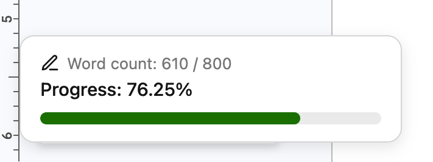

# Write Bar

This Firefox extension displays a floating word count progress bar while you're writing in Google Docs. 

## Features
- Floating word count progress bar
- Live progress percentage with colored gradient 
- Click to set your own custom word goal (default: 800)

---

## Installation
Download the extension from [Firefox Add-ons](https://addons.mozilla.org/en-US/firefox/addon/writebar) 
